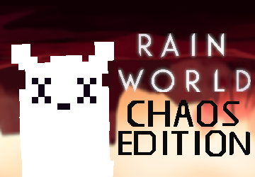

# Rain World: Chaos Edition
  
Rain World: Chaos Edition (RainworldCE) is a BepinEx mod for Rain World 1.5.
It adds random events to the story mode making every cycle potentially more chaotic.
This ranges from negative to neutral to positive events.  
The extensive ConfigMachine integration allows you to configure the mod extensivly allowing for nearly infinite possible scenarios.
### Mod install instructions
If you playing the game via Steam you can simply subscribe to its workshop page at https://steamcommunity.com/sharedfiles/filedetails/
Otherwise you can download the latest version as .zip from https://github.com/Gamer025/RainworldCE/releases/latest 
Place the contained RainWorldCE folder inside RainWorld_Data\StreamingAssets\mods
ConfigMachine is no longer needed in all versions from 2.0.0 onwards as the mod now uses the builtin Remix menu  
Read the contained readme.txt for more version specific information or check out the [Players readme](/Docs/players.md)

### Compiling
For compiling RainworldCE you will want a folder structure like this:  
  
With:  
- Rain World Modded being your Rain World install (containing RainWorld.exe), a symlink to your real install is recommended
- RainworldCE being this project containing RainworldCE.sln
- All the DLLs can be found in your Rain World install (use the PUBLIC-Assembly-CSharp.dll inside Rain World\BepInEx\utils as Assembly-CSharp.dll)
### Creating events
RainworldCE was created with the goal of events being as easily as possible to be created  
It's as easy as creating a new class and setting a few fields + overriding some methods  
See [Creating Events](/Docs/events.md) for more information