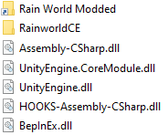

# Rain World: Chaos Edition
Rain World: Chaos Edition (RainworldCE) is a BepinEx mod for Rain World 1.5.
It adds random events to the story mode making every cycle potentially more chaotic.
This ranges from negative to neutral to positive events.  
The extensive ConfigMachine integration allows you to configure the mod extensivly allowing for nearly infinite possible scenarios.
### Mod install instructions
Installing RainworldCE is as easy as downloading the latest .zip from https://github.com/Gamer025/RainworldCE/releases  
Then place the contained .dll in your BepinEx plugin folder / add it to your mod manager.  
ConfigMachine is recommended but the mod will also work without it, using default parameters.  
It's however heavily recommened to install CM to access RainworldCEs extensive config options.  
Read the contained readme.txt for more version specific information or check out the [Players readme](/Docs/players.md)

### Compiling
For compiling RainworldCE you will want a folder structure like this:  
  
With:  
- Rain World Modded being your Rain World install (containing RainWorld.exe)
- RainworldCE being this project containing RainworldCE.sln
- See the official modding wiki to find out where to obtain the DLLs
### Creating events
RainworldCE was created with the goal of events being as easily as possible to be created  
It's as easy as creating a new class and setting a few fields + overriding some methods  
See [Creating Events](/Docs/events.md) for more information